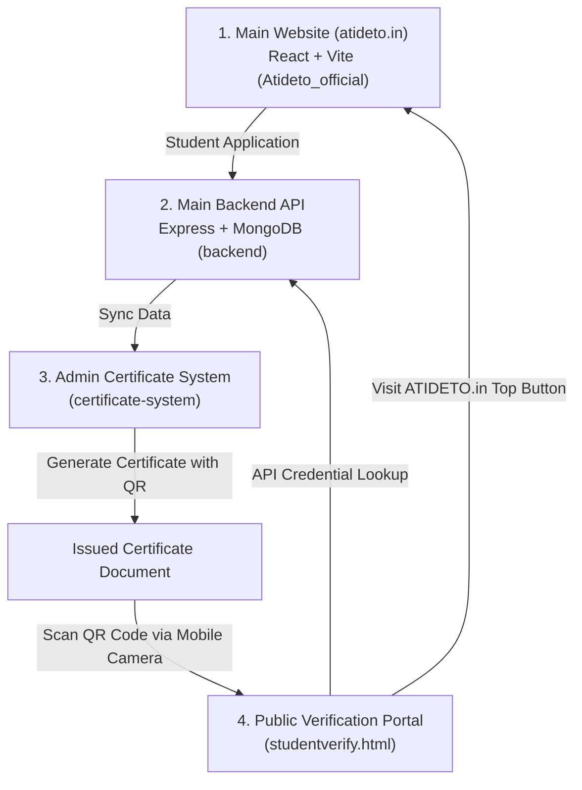

# ATIDETO Technologies — Website & Certificate Verification Ecosystem

This document provides a comprehensive architectural specification and system workflow guide for the **ATIDETO Official Website**, **Backend API**, **Admin Certificate System**, and **Public Student Verification Portal**.

---

## 📐 System Architecture Diagram

---

## 📦 Core Components & Modules

### 1. Main Public Website (`Atideto_official`)
- **Primary Domain**: `https://atideto.in`
- **Tech Stack**: React 18, TypeScript, TailwindCSS, Framer Motion, Vite.
- **Key Features**:
  - Displays company services, academy offerings, location pages, and client intake forms.
  - Receives student internship applications.
  - Linked directly from the public certificate verification header.

---

### 2. Main Backend API (`backend`)
- **Deployment URL**: `https://atideto-backend-system.vercel.app`
- **Tech Stack**: Node.js, Express, TypeScript, MongoDB (Mongoose), Cookie Auth + CSRF.
- **Key Endpoints**:
  - `POST /api/admin/auth/login`: Admin authentication.
  - `GET /api/admin/applications`: List internship applications.
  - `GET /api/certificates/verify/:id`: Public endpoint for verifying certificate authenticity, active status, and scan counts.

---

### 3. Admin Certificate System (`certificate-system`)
- **Deployment URL**: `https://atideto-certificate-system.vercel.app`
- **Tech Stack**: HTML5, Vanilla CSS3, JavaScript (ES6+), html2canvas, jsPDF, QR Server API.
- **Key Features & UI Layout**:
  - **Login Protection**: Before signing in, ONLY the login view (`#loginView`) is displayed. The navigation bar, logout button, and main dashboard area remain hidden.
  - **Authenticated Admin Console (`index.html`)**: Reveals navbar, student records, application filters, and bulk generation tools upon login.
  - **Certificate Preview (`preview.html`) & Offer Letter Generator (`offer-letter-preview.html`)**: Real-time editor with dynamic typography controls and live rendering.

---

### 4. Dedicated Public Student Verification Portal (`studentverify.html`)
- **Verification Endpoint**: `https://atideto-certificate-system.vercel.app/studentverify.html?id=<CERT_ID>`
- **Purpose**: A dedicated public page strictly for students, members, employers, and recruiters who scan the certificate QR code.
- **Key Elements**:
  - **Top Navigation Button**: Prominent **`"Visit ATIDETO.in"`** button at the top right of the header for brand visibility and traffic back to the main site.
  - **Animated Verification Hero**: Features a glowing **"VERIFIED AUTHENTIC PERSON & CERTIFICATE"** badge and explicit verification statement confirming student completion.
  - **Visual Certificate Display Card**: High-resolution rendering of the certificate (with ATIDETO logo, MSME logo, Udyam ID, Student Name, Program/Course, College, Dates, Duration, Signatures, and embedded QR code).
  - **1-Click Downloads**: Direct **Download PNG** and **Download PDF** buttons for mobile/desktop users.
  - **Verification Breakdown Grid**: Displays Student Name, Certificate ID, Course, College, Duration, Dates, and Active Status.

---

## 🔄 End-to-End User Journey

1. **Student Registration**: Student applies for an internship program via `atideto.in`.
2. **Admin Review & Issuance**: Admin signs in to `atideto-certificate-system.vercel.app`, reviews student details, and issues a certificate.
3. **QR Code Embedding**: The system generates a QR code encoding `https://atideto-certificate-system.vercel.app/studentverify.html?id=<CERT_ID>`.
4. **QR Code Scanning**: Recruiter or member scans the QR code using their phone camera.
5. **Mobile Verification Page**: Mobile browser opens `studentverify.html?id=<CERT_ID>` displaying:
   - Glowing **"Verified Authentic Person"** seal.
   - Complete rendered certificate.
   - Download PDF / PNG buttons.
   - **`"Visit ATIDETO.in"`** button at top header.

---

## 🚀 Deployment Specifications

- **Static Assets**: `"outputDirectory": "."` configured in `vercel.json` for static asset serving.
- **URL Rewrites**:
  - `/studentverify/:path*` ➔ `/studentverify.html`
  - `/studentverify` ➔ `/studentverify.html`
  - `/verify/:path*` ➔ `/verify.html`
  - `/api/:path*` ➔ `https://atideto-backend-system.vercel.app/api/:path*`

---

*© 2026 ATIDETO Technologies. All Rights Reserved.*